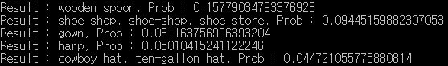

Image Classification using Tensorflow VGG16
===========================================

Tensorflow implementation of the model described in the paper Very Deep Convolutional Networks for Large-Scale Image Recognition.
http://www.robots.ox.ac.uk/~vgg/research/very_deep/

    Very Deep Convolutional Networks for Large-Scale Image Recognition
    K. Simonyan, A. Zisserman
    arXiv Technical report, 2014
    ImageNet Large Scale Visual Recognition Competition 2014.

Training Usage
-----

    python TrainingModel.py train_data_file max_epoch batch_size output_npy_file
    
    ex)
    python TrainingModel.py ./data/train_data.txt 3 3 ./vgg16/save_model.npy

Training Result
------

Prediction Usage
-----

    python PredictionImage.py vgg_npy_file imagenet_label_file input_image_file
    
    ex)
    python PredictionImage.py ./vgg16/vgg16.npy ./vgg16/imagenet_classes.txt ./example/lena.jpg

Prediction Result
------

 
